# KB Tool - Scout version with Algolia

Knowledge Base question answer searching website.
Previously I have used MySQL full-text indexing and searching for implementing full-text search. 
But here I am using Laravel Scout with Algolia driver. Scout provides driver based solution for full-text search to Eloquent models.

## Demo Link

http://kbtool.herokuapp.com/

I saw a job post on UPWORK and thought I should try it for fun. The job description is given below.


## Screenshot of Job Details

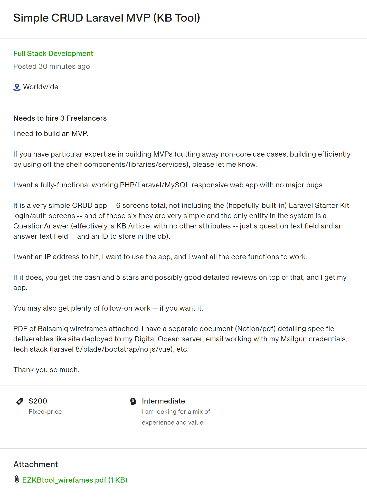

## Screenshots of PDF pages

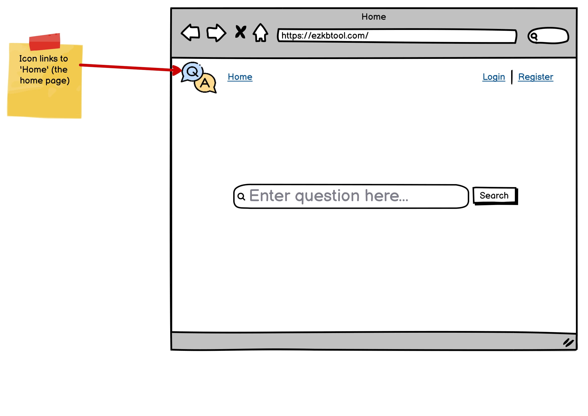
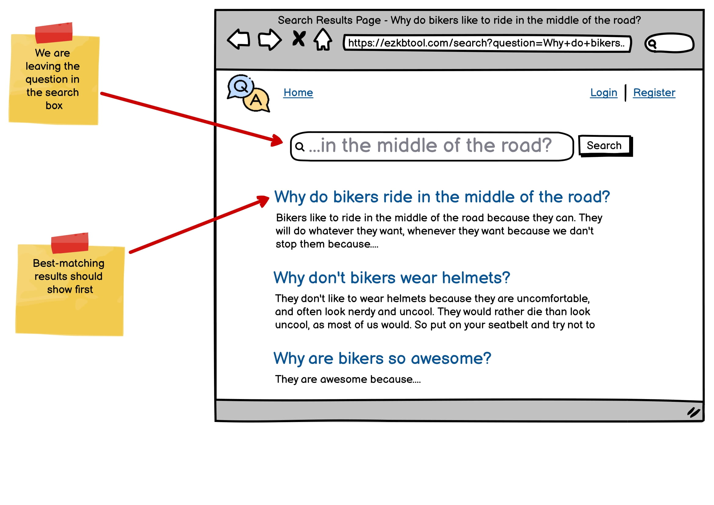
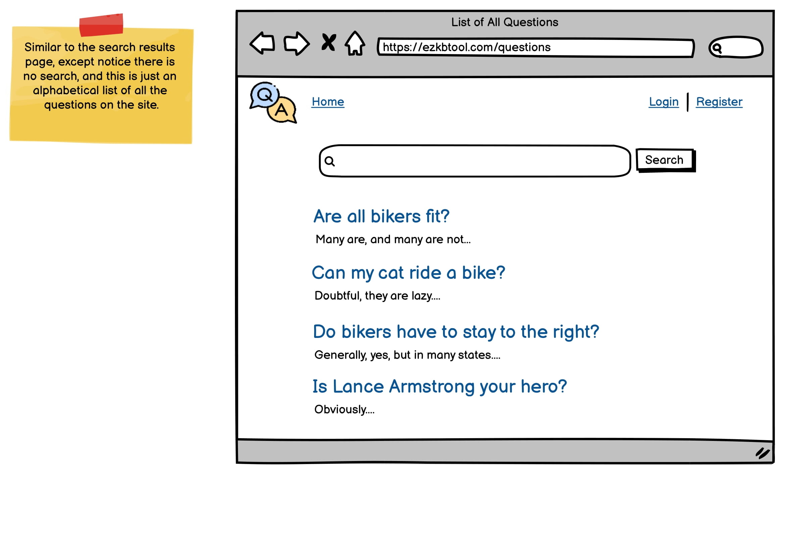
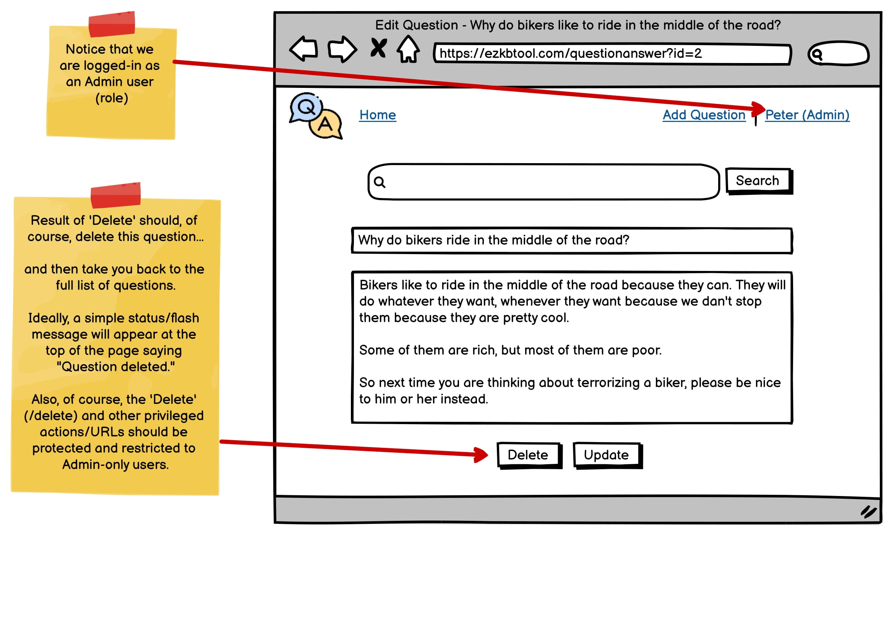
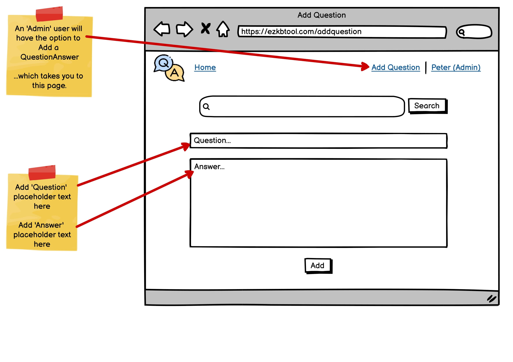


## Requirements

- Laravel 8.X
- \>= PHP 7.3

## Installation

```
git clone https://github.com/rumyTM/kbtool-scout.git
cd kbtool-scout
composer install
cp .env.example .env
php artisan key:generate
```
You should configure your Algolia id and secret credentials in ```config/scout.php``` configuration file.
```
php artisan migrate --seed
php artisan scout:import "App\Models\Question"
```

## Screenshots of the Website


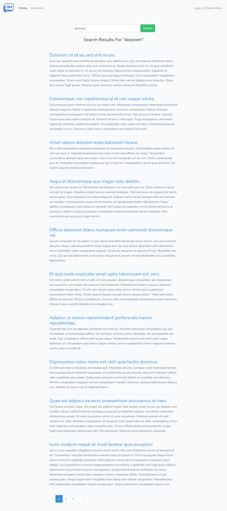

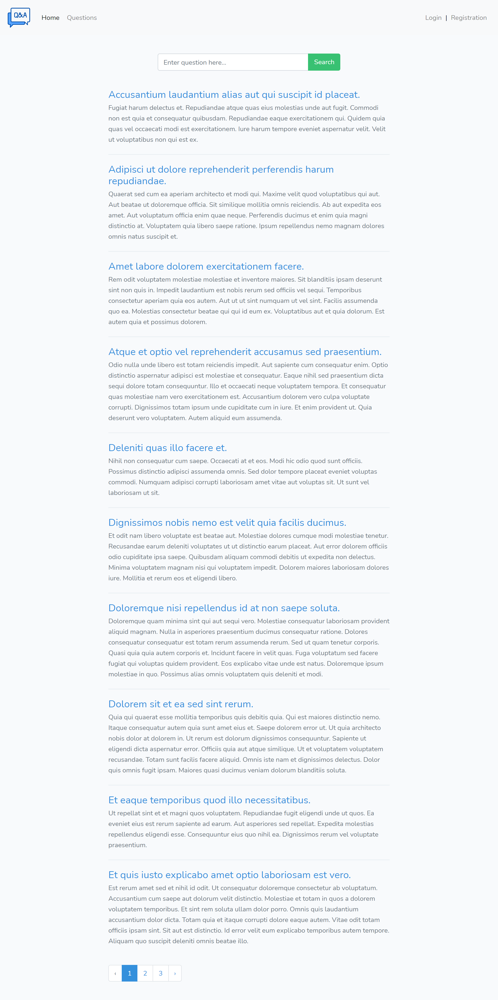

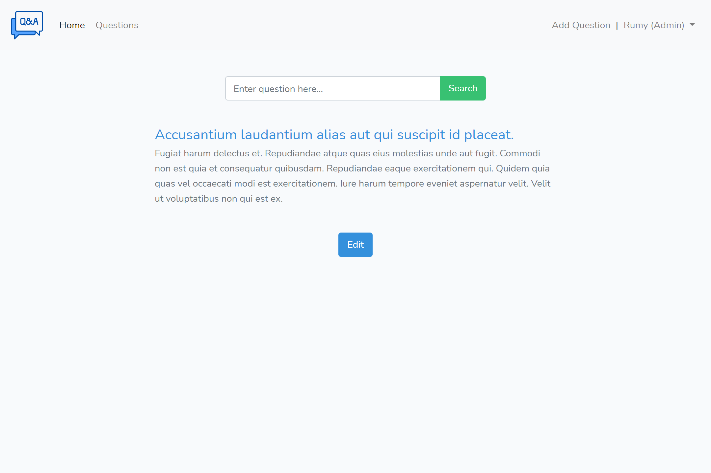

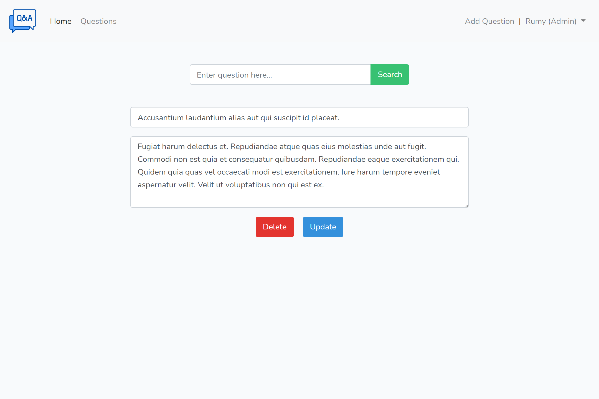

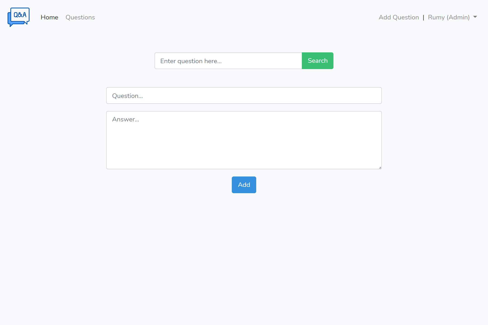

